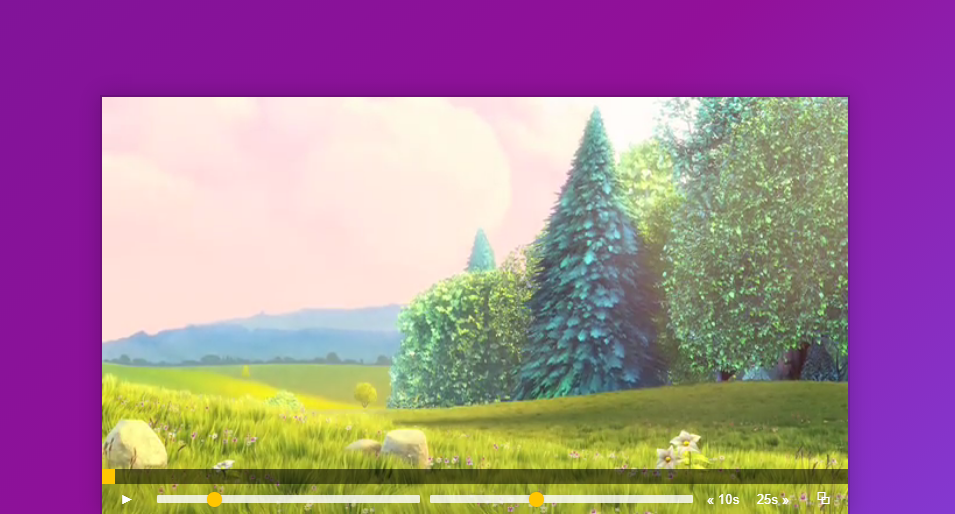

# Vanilla-JavaScript
<h2>Screenshots of Short Project</h2>
<ol>
  <li><b>AJAX TYPE AHEAD</b>  </li>  
  <li><b>CLOCK</b>  </li>  
  <li><b>CUSTOM HTML5 VIDEO PLAYER</b>  </li>  
  <li><b>FLEX PANELS IMAGE GALLERY</b>  </li>  
  <li><b>FUN WITH HTML5</b>  </li>  
  <li><b>HOLD SHIFT TO CHECK MULTIPLE FLEXBOXES</b>  </li>  
  <li><b>KEYPAD</b>  </li>  
  <li><b>KEY SEQUENCE DETECTOR(KANOMI CODE)</b>  </li>  
  <li><b>LOCAL STORAGE</b>  </li>  
  <li><b>MOUSE MOVE TEXT SHADOW</b>  </li>  
  <li><b>PLAY WITH JS VARIABLES</b>  </li>  
  <li><b>SLIDE IN ON SCROLL</b>  </li>  
  <li>  </li>  
  <li>  </li>  
  <li>  </li>
</ol>

